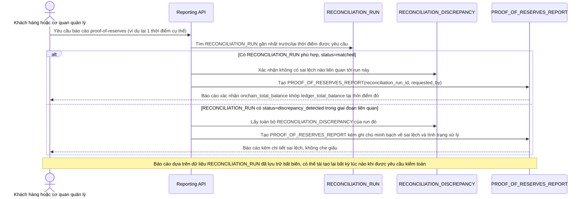

# Enhance sequence — Xuất báo cáo proof-of-reserves từ lịch sử đối soát

Đây là **enhance**, flow hoàn toàn mới, phát sinh từ enhance — chưa tồn tại ở base (base không lưu trữ lịch sử đối soát nên không có gì để báo cáo). Đáp ứng yêu cầu 5 của đề bài: toàn bộ quá trình đối soát và sai lệch phát hiện được lưu trữ minh bạch, có khả năng phục vụ báo cáo proof-of-reserves cho khách hàng/cơ quan quản lý khi được yêu cầu.

