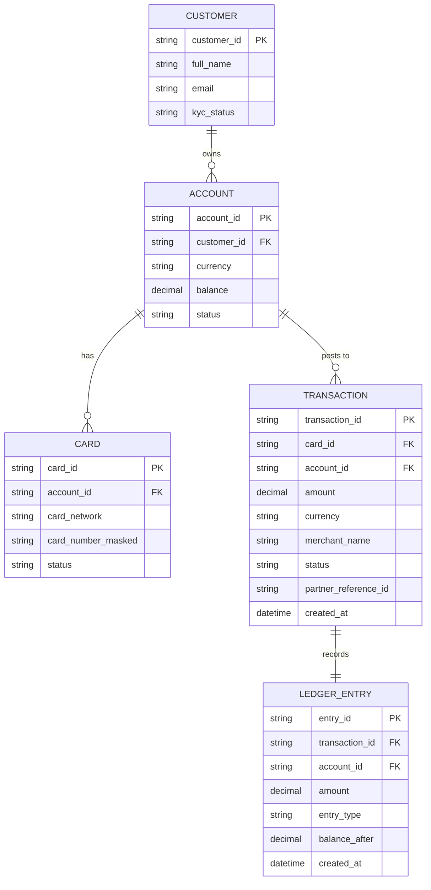

# ERD — Base (trước khi có đối soát cuối ngày)

Đây là **base**: mô hình dữ liệu suy luận cho hệ thống ngân hàng số *trước khi* có flow đối soát. Đề bài giả định ngân hàng đã xử lý giao dịch thẻ qua đối tác (mạng thẻ) và ghi sổ cái nội bộ — nếu không có sẵn Account/Transaction/Ledger thì "đối soát ledger nội bộ với báo cáo đối tác" sẽ không có nghĩa. ERD chỉ dựng phần lõi phục vụ giao dịch thẻ + ghi sổ, không suy diễn thêm các module không liên quan (chuyển khoản nội địa, tiết kiệm, thẻ tín dụng...).

