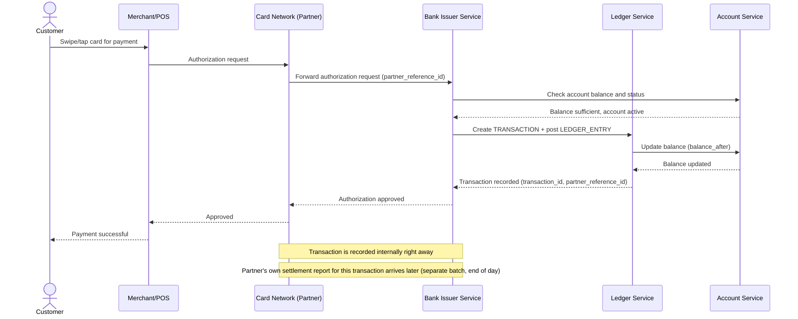

# Sequence Diagram — Base: Process Card Transaction

Đây là **base**, flow "xử lý giao dịch thẻ" — tiền đề bắt buộc cho đối soát: chính flow này tạo ra các `TRANSACTION` và `LEDGER_ENTRY` mà cuối ngày phải được đối chiếu với báo cáo của đối tác mạng thẻ. Đặc biệt, `partner_reference_id` được sinh ra ở bước này là khóa nối giữa hai phía khi đối soát.

