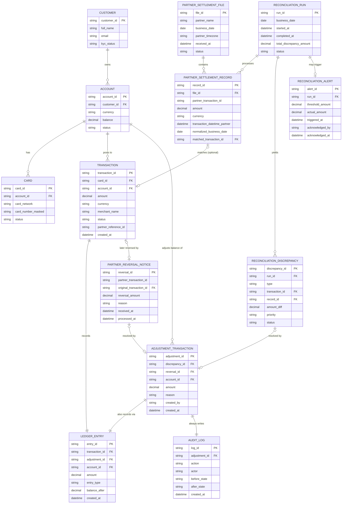

# ERD — Enhance (sau khi có đối soát cuối ngày)

Đây là **enhance**: ERD base cộng với các entity phục vụ đúng 5 yêu cầu của đề bài — nhận file batch đối tác (có thể trễ/khác múi giờ), phân loại 3 loại sai lệch, xử lý giao dịch bị đối tác báo hoàn sau khi đã khớp, audit trail cho mọi điều chỉnh số dư, và ngưỡng cảnh báo tự động. So với base, `LEDGER_ENTRY` không đổi cấu trúc nhưng nay còn được tạo bởi `ADJUSTMENT_TRANSACTION` (không chỉ bởi `TRANSACTION` gốc) — đây là cách duy nhất để sửa số dư, không sửa trực tiếp.

