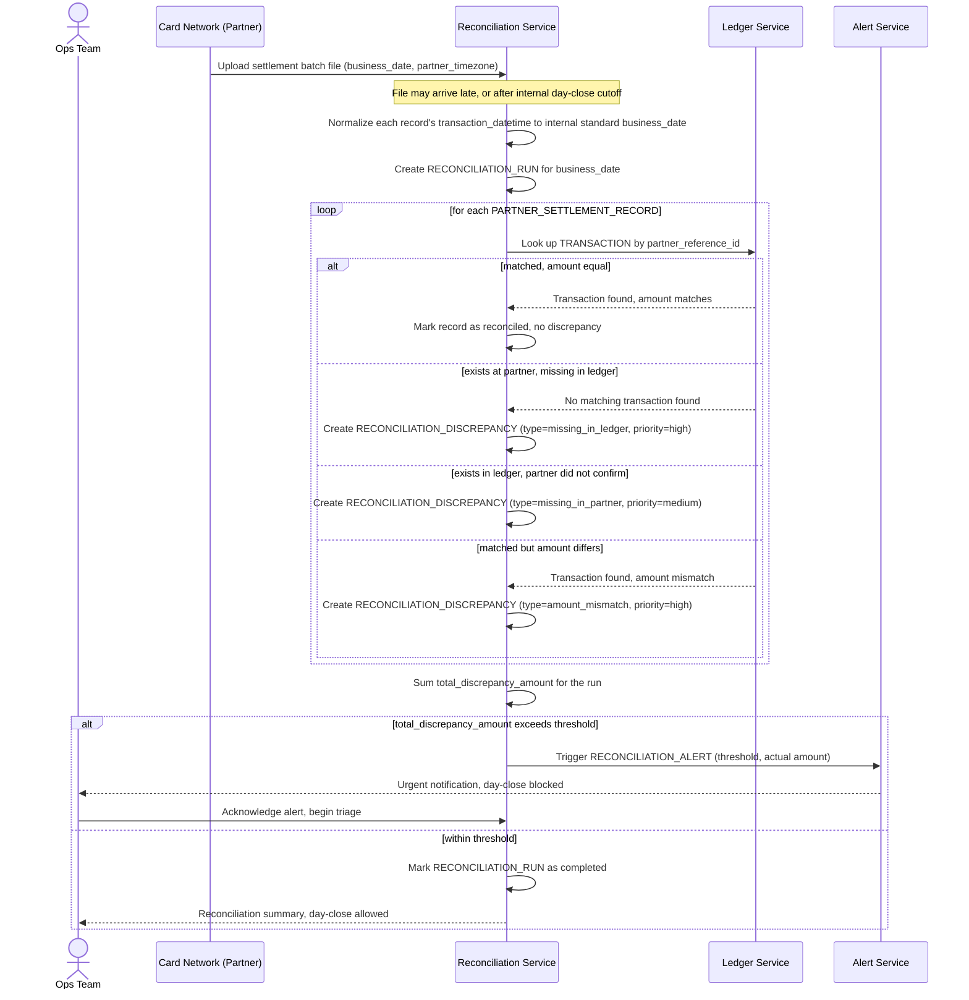

# Sequence Diagram — Enhance: Daily Reconciliation

Đây là **enhance**, flow chính hoàn toàn mới mà đề bài yêu cầu: đối soát cuối ngày giữa ledger nội bộ và file batch từ đối tác mạng thẻ. Flow này thể hiện yêu cầu chuẩn hóa "ngày giao dịch" giữa hai múi giờ, phân loại 3 loại sai lệch với mức ưu tiên khác nhau, và ngưỡng cảnh báo tự động khi tổng sai lệch vượt mức — tất cả chưa tồn tại ở base.

