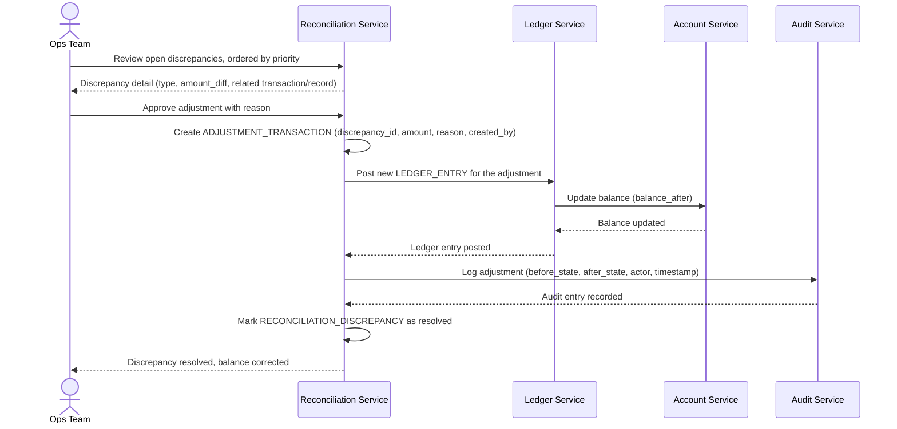

# Sequence Diagram — Enhance: Handle Discrepancy

Đây là **enhance**, flow mới xử lý một `RECONCILIATION_DISCREPANCY` được tạo ra từ flow đối soát ([4-enhance-daily-reconciliation-sqd.md](4-enhance-daily-reconciliation-sqd.md)). Flow này thể hiện yêu cầu "không thể sửa trực tiếp số dư mà không qua bước ghi nhận giao dịch điều chỉnh tương ứng" và audit trail đầy đủ — số dư khách hàng (vốn chỉ được cập nhật qua LEDGER_ENTRY ở base) nay chỉ có thể thay đổi thêm qua một ADJUSTMENT_TRANSACTION được audit.

