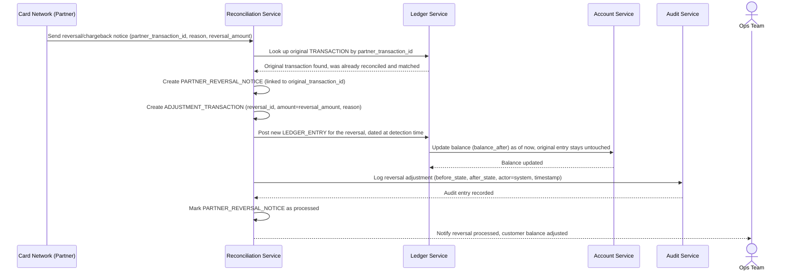

# Sequence Diagram — Enhance: Handle Partner Reversal

Đây là **enhance**, flow mới xử lý trường hợp đối tác báo hoàn/đảo một giao dịch (ví dụ tranh chấp thẻ) sau một khoảng thời gian, kể cả khi giao dịch gốc đã đối soát khớp từ trước ở flow [4-enhance-daily-reconciliation-sqd.md](4-enhance-daily-reconciliation-sqd.md). Flow này tái sử dụng cơ chế điều chỉnh có audit trail giống [5-enhance-handle-discrepancy-sqd.md](5-enhance-handle-discrepancy-sqd.md), nhưng khởi phát từ thông báo của đối tác thay vì từ chạy đối soát, và số dư phải được điều chỉnh đúng tại thời điểm phát hiện chứ không lùi lại ngày giao dịch gốc.

