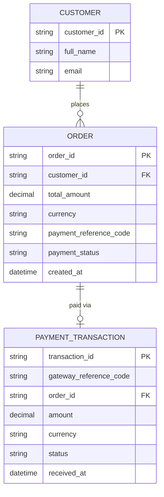

# ERD — Base (trước khi có đối soát cổng thanh toán)

Đây là **base**: mô hình dữ liệu suy luận cho sàn e-commerce *trước khi* có flow đối soát. Đề bài giả định hệ thống đã có đơn hàng, đã tích hợp cổng thanh toán bên thứ ba và đã lưu lại các giao dịch cổng trả về (qua webhook) gắn với mã tham chiếu — nếu không có sẵn `ORDER` mang `payment_reference_code` và `PAYMENT_TRANSACTION` ghi nhận giao dịch cổng thì "khớp giao dịch cổng với đơn hàng" sẽ không có nghĩa. ERD chỉ dựng phần lõi phục vụ thanh toán đơn hàng, không suy diễn thêm các module không liên quan (khuyến mãi, vận chuyển...).

