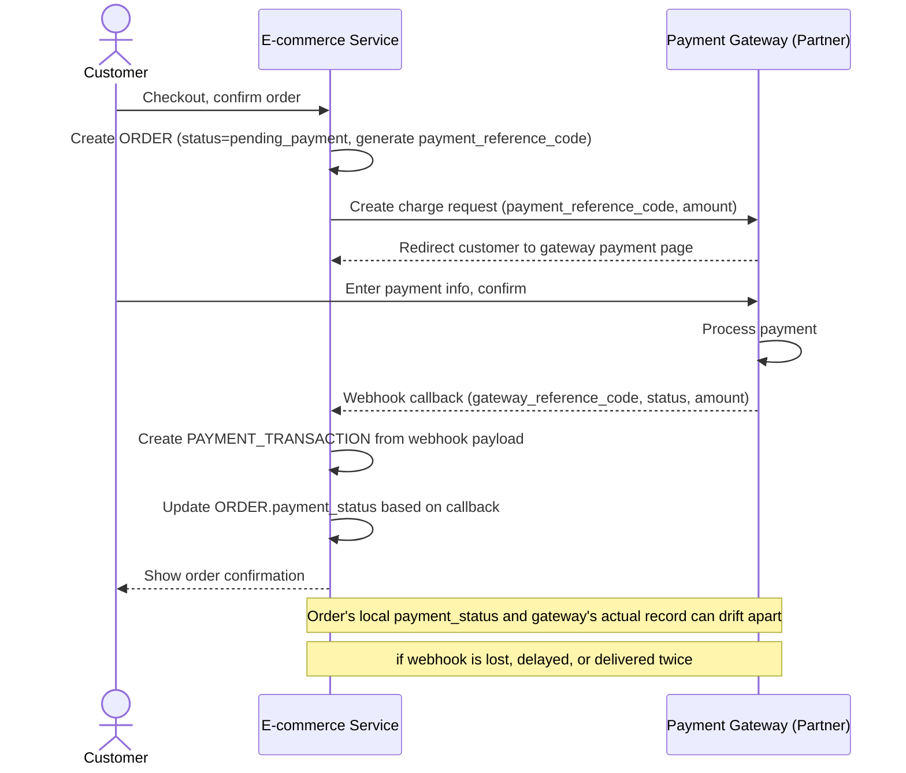

# Sequence Diagram — Base: Checkout Payment

Đây là **base**, flow "thanh toán khi checkout" — tiền đề bắt buộc cho đối soát: chính flow này tạo ra `ORDER` với `payment_reference_code` và `PAYMENT_TRANSACTION` từ webhook của cổng thanh toán, hai dữ liệu mà job đối soát sau này phải khớp với nhau.

