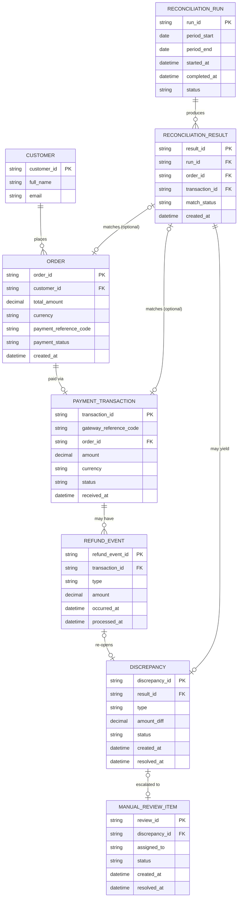

# ERD — Enhance (sau khi có đối soát cổng thanh toán)

Đây là **enhance**: ERD base cộng với các entity phục vụ đúng 5 yêu cầu của đề bài — chạy job đối soát khớp theo mã tham chiếu, phân loại rõ 4 loại sai lệch, xử lý refund/chargeback phát sinh sau khi đã khớp, đảm bảo job chạy lại (re-run) không tạo trùng lặp, và hàng đợi xử lý thủ công có theo dõi trạng thái cho sai lệch không tự giải quyết được. So với base, `ORDER` và `PAYMENT_TRANSACTION` không đổi cấu trúc, chỉ được tham chiếu thêm bởi các entity đối soát mới.

