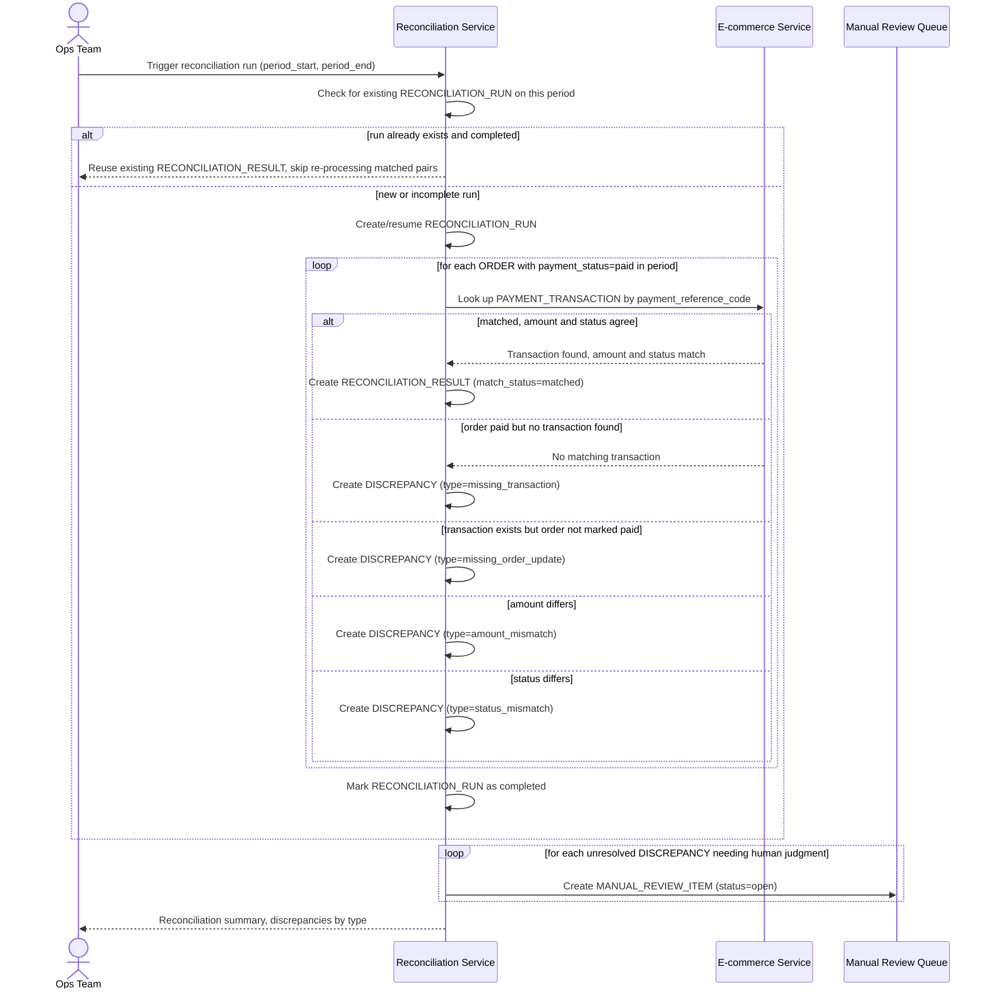

# Sequence Diagram — Enhance: Periodic Reconciliation

Đây là **enhance**, flow chính hoàn toàn mới mà đề bài yêu cầu: đối soát định kỳ giữa `ORDER` và `PAYMENT_TRANSACTION`. Flow thể hiện việc khớp theo mã tham chiếu duy nhất, phân loại 4 loại sai lệch (thiếu giao dịch, thừa giao dịch, sai số tiền, sai trạng thái), và tính idempotent khi chạy lại nhiều lần trên cùng khoảng thời gian — tất cả chưa tồn tại ở base.

