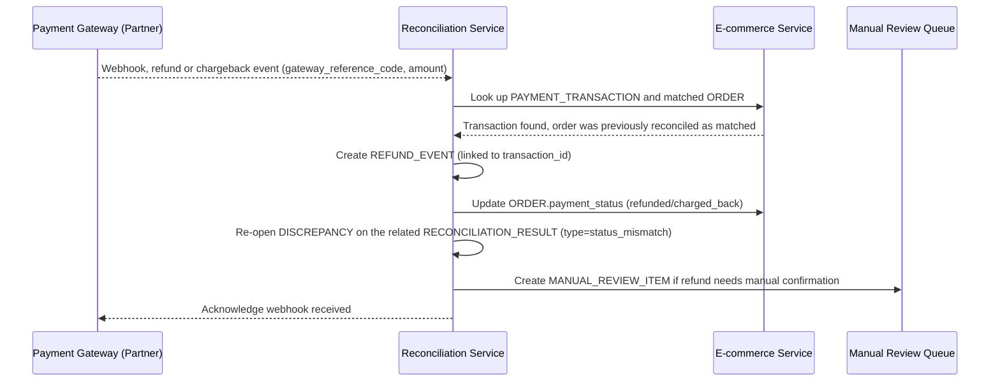

# Sequence Diagram — Enhance: Handle Post-Reconciliation Refund/Chargeback

Đây là **enhance**, flow mới xử lý refund/chargeback xảy ra *sau khi* một đơn hàng đã đối soát khớp thành công (xem [4-enhance-periodic-reconciliation-sqd.md](4-enhance-periodic-reconciliation-sqd.md)). Flow này đảm bảo yêu cầu "không để đơn hàng hiển thị đã đối soát khớp khi thực tế tiền đã được hoàn" — bằng cách mở lại DISCREPANCY cho RECONCILIATION_RESULT liên quan thay vì để trạng thái matched cũ đứng yên.

