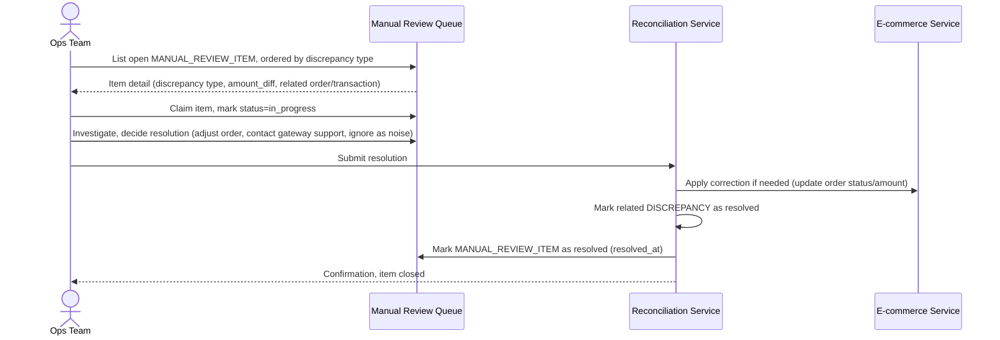

# Sequence Diagram — Enhance: Manual Review Queue

Đây là **enhance**, flow mới cho đội vận hành xử lý các `MANUAL_REVIEW_ITEM` phát sinh từ đối soát ([4-enhance-periodic-reconciliation-sqd.md](4-enhance-periodic-reconciliation-sqd.md), [5-enhance-handle-post-reconciliation-refund-sqd.md](5-enhance-handle-post-reconciliation-refund-sqd.md)). Flow này đảm bảo yêu cầu "không có sai lệch nào bị bỏ quên" bằng cách theo dõi trạng thái xử lý tường minh cho từng sai lệch cần con người can thiệp.

