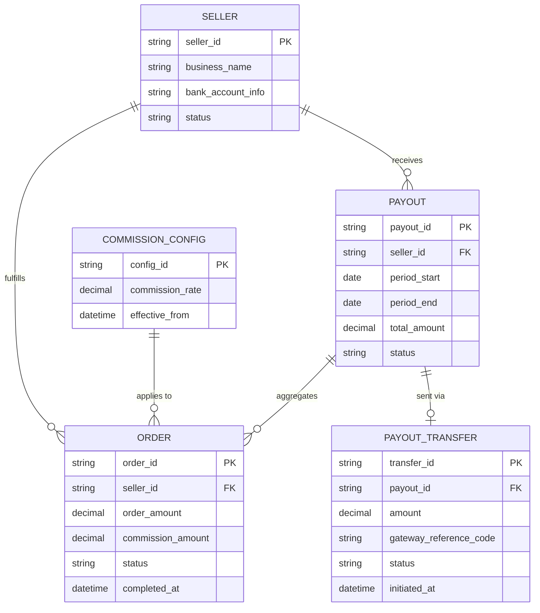

# ERD — Base (trước khi có đối soát payout seller)

Đây là **base**: mô hình dữ liệu suy luận cho marketplace đa seller *trước khi* có flow đối soát payout. Đề bài giả định sàn đã thu tiền từ người mua, đã tính hoa hồng theo cấu hình phí, và đã có cơ chế tính/chuyển tiền định kỳ cho seller — nếu không có sẵn `ORDER`, `COMMISSION_CONFIG` và `PAYOUT` thì "đối soát số tiền tính toán với số tiền thực chuyển" sẽ không có nghĩa. ERD chỉ dựng phần lõi phục vụ payout, không suy diễn thêm các module không liên quan (catalog, review...).

