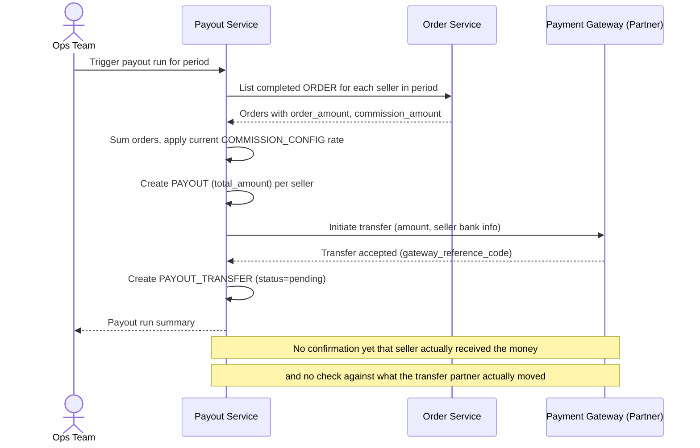

# Sequence Diagram — Base: Calculate Payout

Đây là **base**, flow "tính và chuyển payout cho seller" theo kỳ — tiền đề bắt buộc cho đối soát: chính flow này tạo ra `PAYOUT` (số tiền sàn tính seller được nhận) và `PAYOUT_TRANSFER` (lệnh chuyển tiền thực), hai con số mà đối soát sau này phải khớp với nhau. Ở base, flow này còn đơn giản, chưa xử lý cutoff nhất quán hay lịch sử phí.

