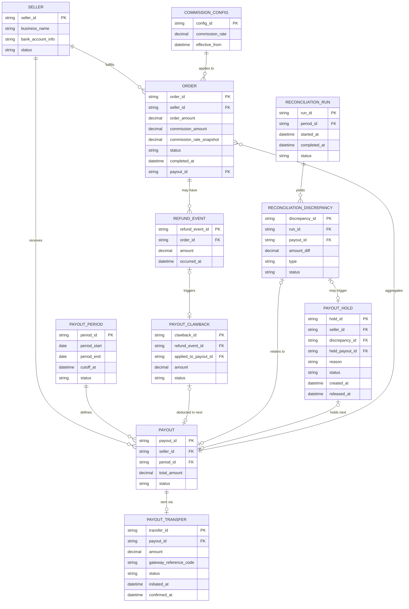

# ERD — Enhance (sau khi có đối soát payout seller)

Đây là **enhance**: ERD base cộng với các entity phục vụ đúng 4 yêu cầu của đề bài — cutoff nhất quán theo kỳ, xử lý hoàn tiền phát sinh sau payout (clawback), phân biệt "đã lên lệnh chuyển" với "seller thực nhận", và hold kỳ payout tiếp theo khi phát hiện sai lệch. So với base, `ORDER` nay lưu thêm `commission_rate_snapshot` chốt tại thời điểm hoàn tất (không tính lại theo cấu hình hiện tại), và `PAYOUT_TRANSFER` có thêm trạng thái xác nhận rõ ràng.

