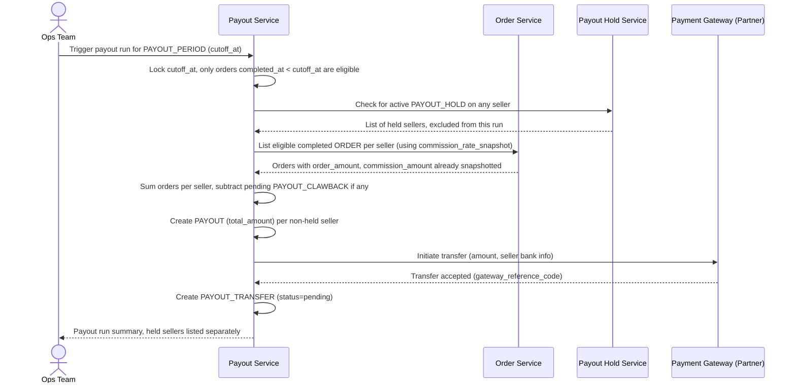

# Sequence Diagram — Enhance: Calculate Payout

Đây là **enhance**, flow "tính payout" đã có ở base ([2-base-calculate-payout-sqd.md](2-base-calculate-payout-sqd.md)) nhưng nay thay đổi ở hai điểm: (1) dùng `PAYOUT_PERIOD.cutoff_at` cố định để xác định đơn nào thuộc kỳ nào thay vì mốc thời gian ngầm định, tránh tính trùng/bỏ sót; (2) mỗi `ORDER` dùng đúng `commission_rate_snapshot` đã chốt tại thời điểm hoàn tất thay vì `COMMISSION_CONFIG` hiện hành.

