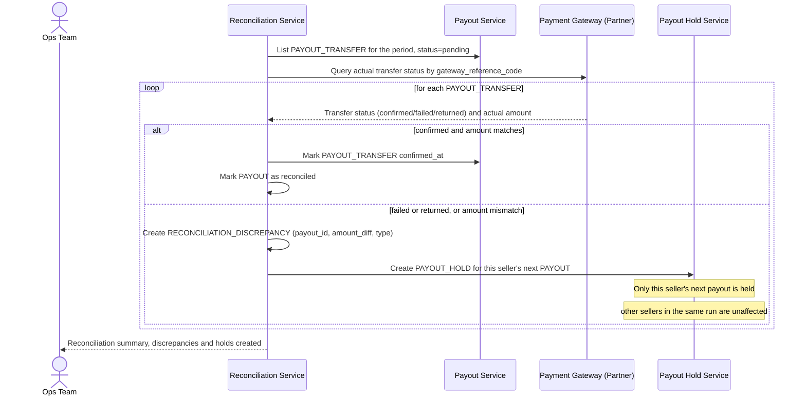

# Sequence Diagram — Enhance: Reconcile Payout

Đây là **enhance**, flow mới hoàn toàn: đối soát giữa `PAYOUT.total_amount` (số tiền sàn tính) và trạng thái thực tế của `PAYOUT_TRANSFER`. Flow này thể hiện yêu cầu phân biệt "đã lên lệnh chuyển" với "seller thực nhận" — chỉ coi kỳ đã đóng khi transfer được đối tác xác nhận thành công — và tạo `PAYOUT_HOLD` cho seller có sai lệch mà không ảnh hưởng các seller khác.

