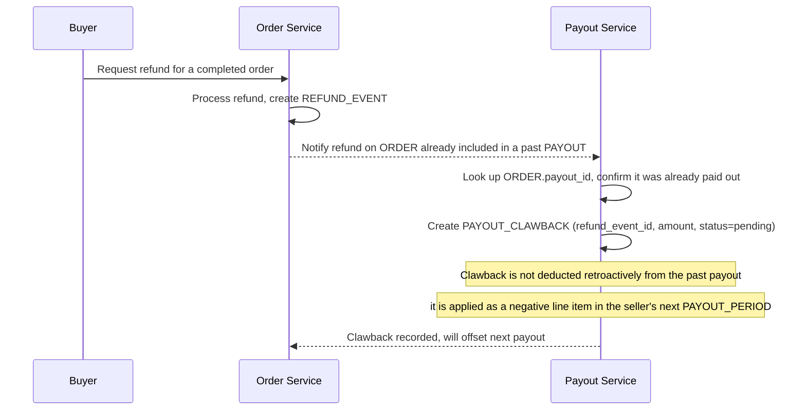

# Sequence Diagram — Enhance: Handle Refund Clawback

Đây là **enhance**, flow mới xử lý trường hợp một `ORDER` đã được tính vào `PAYOUT` đã chuyển tiền, nhưng sau đó phát sinh hoàn tiền cho người mua. Flow này thể hiện yêu cầu "phát hiện được các khoản âm" thay vì chỉ cộng dồn một chiều, bằng cách tạo `PAYOUT_CLAWBACK` để trừ vào kỳ payout tiếp theo của đúng seller đó.

