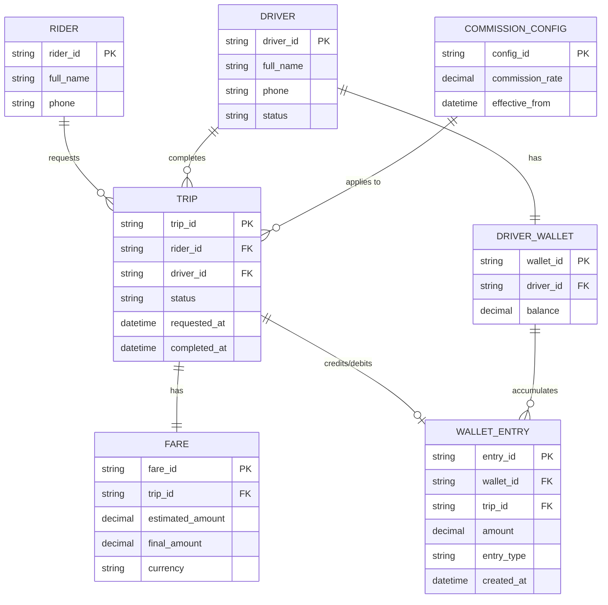

# ERD — Base (trước khi có đối soát cuốc xe/tài xế/hoa hồng)

Đây là **base**: mô hình dữ liệu suy luận cho ứng dụng gọi xe *trước khi* có flow đối soát ba chiều (khách trả - tài xế nhận - hoa hồng nền tảng). Đề bài giả định hệ thống đã có cuốc xe với giá cước, đã tính hoa hồng và đã chia tiền cho tài xế qua ví — nếu không có sẵn `TRIP`, `FARE` và `DRIVER_WALLET` thì "đối soát ba khoản khớp đúng cho từng cuốc" sẽ không có nghĩa. ERD chỉ dựng phần lõi phục vụ cuốc xe + chia tiền, không suy diễn thêm các module không liên quan (khuyến mãi, đánh giá tài xế...).

