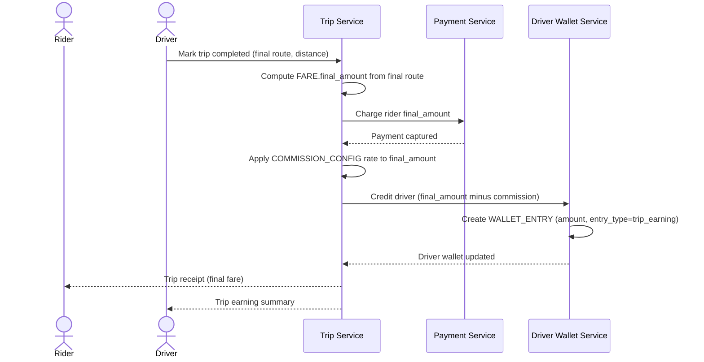

# Sequence Diagram — Base: Complete Trip and Split Payment

Đây là **base**, flow "hoàn tất cuốc xe và chia tiền" — tiền đề bắt buộc cho đối soát: chính flow này chốt `FARE.final_amount`, tính hoa hồng theo `COMMISSION_CONFIG`, và ghi `WALLET_ENTRY` cho tài xế. Ba con số (khách trả, tài xế nhận, hoa hồng giữ lại) sinh ra ở đây chính là ba khoản mà đối soát sau này phải khớp với nhau cho từng cuốc.

