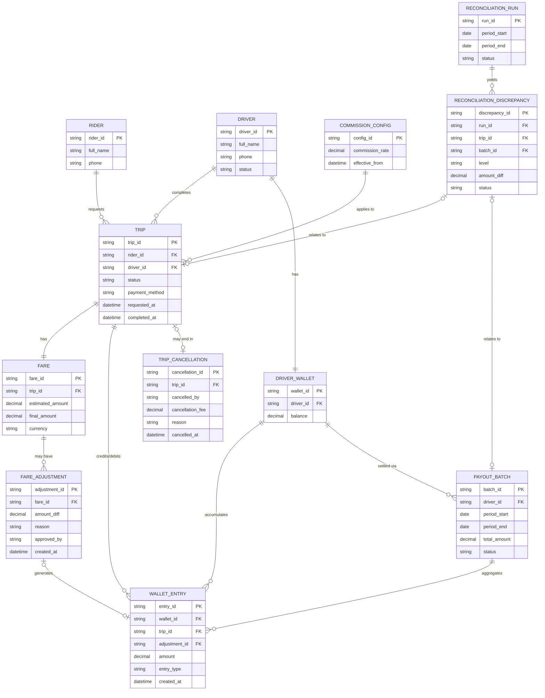

# ERD — Enhance (sau khi có đối soát cuốc xe/tài xế/hoa hồng)

Đây là **enhance**: ERD base cộng với các entity phục vụ đúng 5 yêu cầu của đề bài — cuốc bị hủy giữa chừng có phí một phần, giá cước điều chỉnh sau khi cuốc kết thúc, thanh toán tiền mặt theo dõi riêng, điều chỉnh phát sinh từ tranh chấp giá, và đối soát ở cả mức cuốc lẫn mức đợt thanh toán. So với base, `WALLET_ENTRY` nay còn được tạo bởi `FARE_ADJUSTMENT` và `TRIP_CANCELLATION` (không chỉ bởi cuốc hoàn tất bình thường), và `TRIP` có thêm cờ `payment_method` để phân biệt tiền mặt.

