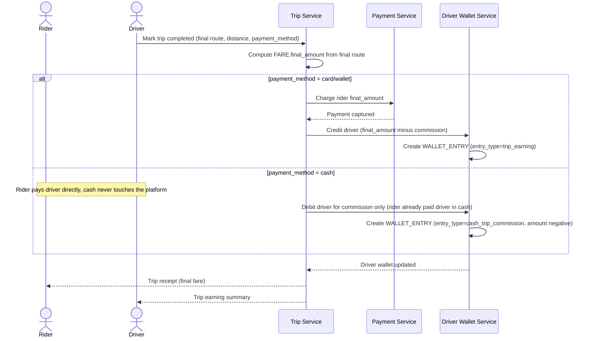

# Sequence Diagram — Enhance: Complete Trip and Split Payment

Đây là **enhance**, flow "hoàn tất cuốc và chia tiền" đã có ở base ([2-base-complete-trip-payment-sqd.md](2-base-complete-trip-payment-sqd.md)) nhưng nay thay đổi ở chỗ: cuốc trả tiền mặt không đi qua Payment Service để thu tiền từ khách, nhưng hoa hồng vẫn phải bị trừ vào ví tài xế theo hướng ngược lại, thay vì chỉ cộng dồn một chiều như base.

