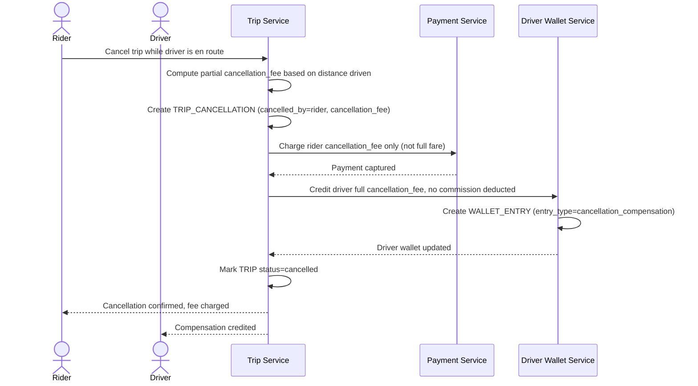

# Sequence Diagram — Enhance: Cancel Trip With Partial Fee

Đây là **enhance**, flow mới xử lý cuốc bị hủy giữa chừng sau khi tài xế đã di chuyển một đoạn. Flow này thể hiện yêu cầu "phân biệt rõ luồng tiền của cuốc hoàn tất và cuốc hủy có phí bồi thường" — không tính hoa hồng theo logic cuốc bình thường, mà tạo `TRIP_CANCELLATION` với phí hủy một phần riêng.

