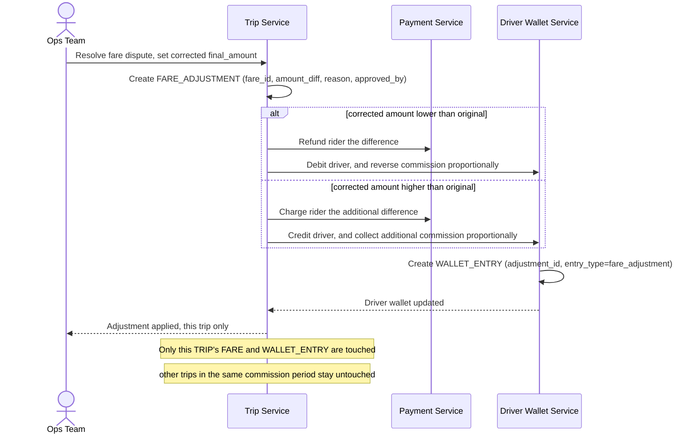

# Sequence Diagram — Enhance: Fare Adjustment After Dispute

Đây là **enhance**, flow mới xử lý tranh chấp giá giữa khách và tài xế được giải quyết *sau khi* cuốc đã kết thúc và tiền đã chia (theo [4-enhance-complete-trip-payment-sqd.md](4-enhance-complete-trip-payment-sqd.md)). Flow này thể hiện yêu cầu điều chỉnh đúng cho cả ba bên (khách, tài xế, hoa hồng) mà không làm sai lệch báo cáo của các cuốc khác trong cùng kỳ.

