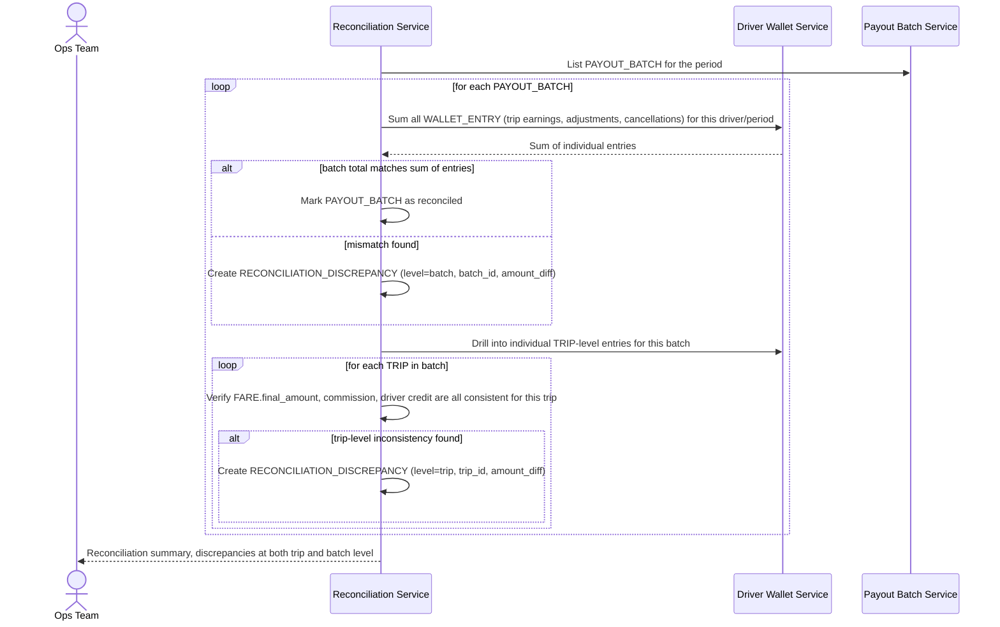

# Sequence Diagram — Enhance: Driver Payout Reconciliation

Đây là **enhance**, flow mới đối soát ở cả mức chi tiết từng cuốc lẫn mức tổng hợp theo đợt thanh toán (`PAYOUT_BATCH`). Flow này thể hiện yêu cầu "đối soát ở cả mức chi tiết và mức tổng hợp để phát hiện sai lệch dù nhỏ không bị pha loãng" khi tài xế có khối lượng cuốc lớn mỗi ngày.

