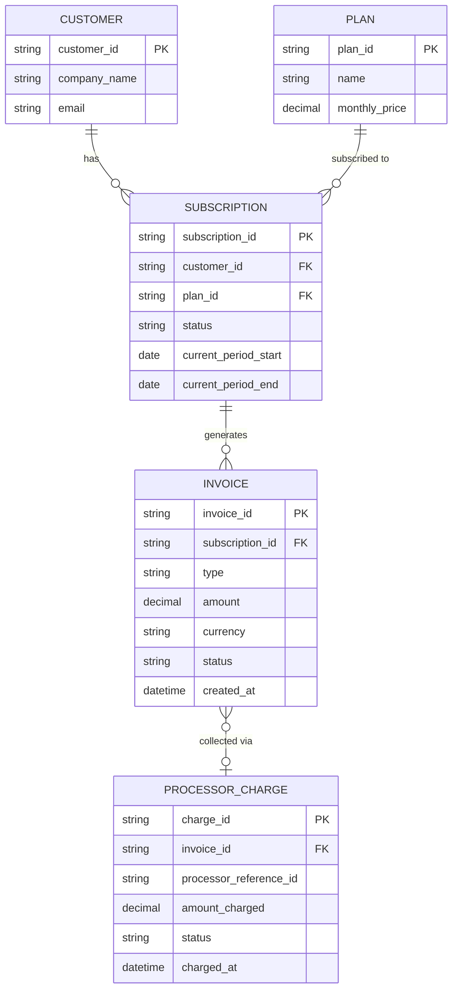

# ERD — Base (trước khi có đối soát billing với processor)

Đây là **base**: mô hình dữ liệu suy luận cho SaaS thuê bao *trước khi* có flow đối soát. Đề bài giả định hệ thống đã có billing nội bộ phát sinh invoice (kể cả invoice điều chỉnh proration khi đổi gói) và đã tích hợp payment processor để thu tiền — nếu không có sẵn `INVOICE` và `PROCESSOR_CHARGE` thì "đối soát billing nội bộ với số tiền processor báo cáo" sẽ không có nghĩa. ERD chỉ dựng phần lõi phục vụ billing + thu tiền, không suy diễn thêm các module không liên quan (support ticket, usage metering chi tiết...).

