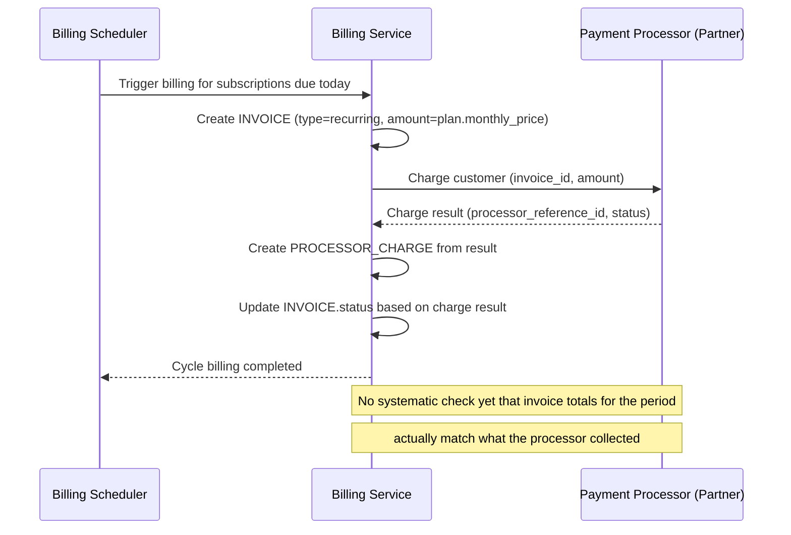

# Sequence Diagram — Base: Charge Subscription Cycle

Đây là **base**, flow "thu tiền định kỳ hàng tháng" — tiền đề bắt buộc cho đối soát: chính flow này tạo ra `INVOICE` (type=recurring) và `PROCESSOR_CHARGE` tương ứng, hai dữ liệu mà đối soát sau này phải khớp với nhau theo từng chu kỳ.

