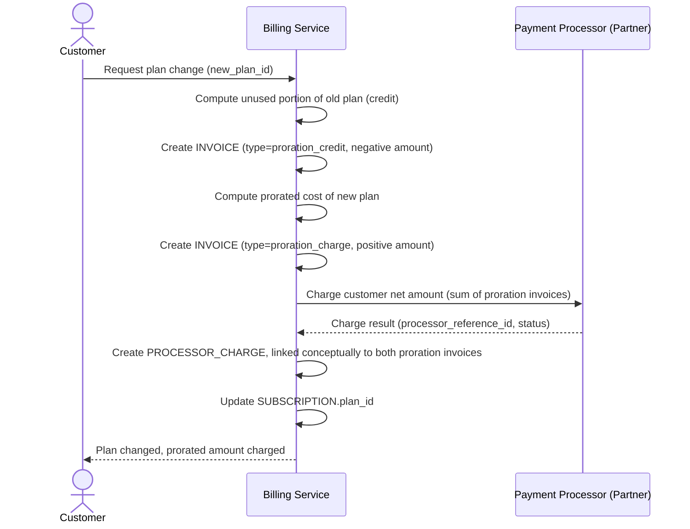

# Sequence Diagram — Base: Change Plan With Proration

Đây là **base**, flow "đổi gói giữa chu kỳ" — cũng là tiền đề cho đối soát vì đề bài mô tả đây là nguồn phát sinh "nhiều invoice điều chỉnh nhỏ trong cùng khoảng thời gian ngắn" mà đối soát phải khớp tổng lại với đúng một lượt thu tiền từ processor.

