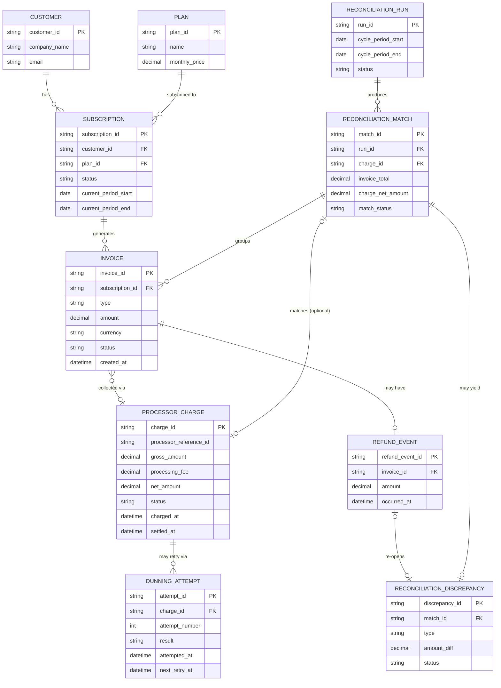

# ERD — Enhance (sau khi có đối soát billing với processor)

Đây là **enhance**: ERD base cộng với các entity phục vụ đúng 5 yêu cầu của đề bài — khớp nhóm invoice proration với đúng một lượt thu, phân biệt "đang retry" với "thất bại hẳn" ở dunning, cập nhật lại đối soát khi có hoàn tiền sau khớp, tách phí xử lý khỏi số tiền gộp, và xử lý riêng giao dịch cận ranh giới chu kỳ. So với base, `PROCESSOR_CHARGE` nay lưu thêm `processing_fee` và `net_amount`, và có thêm `DUNNING_ATTEMPT` để theo dõi lịch sử retry thay vì chỉ một status tĩnh.

