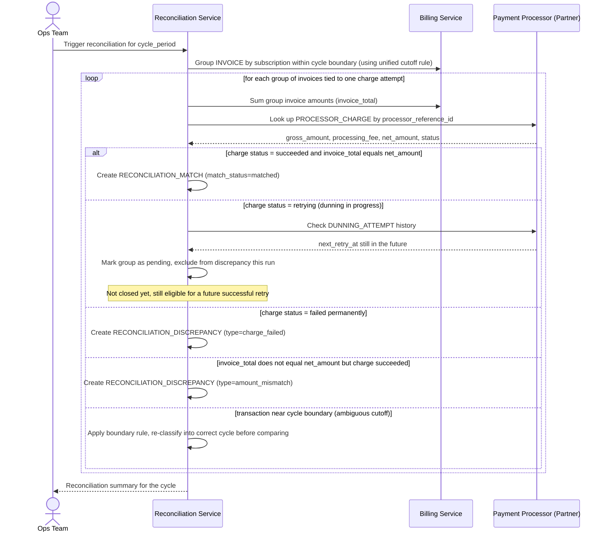

# Sequence Diagram — Enhance: Reconcile Billing Cycle

Đây là **enhance**, flow chính hoàn toàn mới: đối soát giữa nhóm `INVOICE` (kể cả các invoice proration nhỏ phát sinh khi đổi gói, xem [3-base-change-plan-proration-sqd.md](3-base-change-plan-proration-sqd.md)) với đúng một `PROCESSOR_CHARGE`. Flow thể hiện việc tách `processing_fee` khỏi `gross_amount` để so đúng `net_amount`, phân biệt trạng thái "đang chờ retry" (dunning) với "thất bại hẳn", và có bước xử lý riêng cho giao dịch cận ranh giới chu kỳ do lệch múi giờ.

