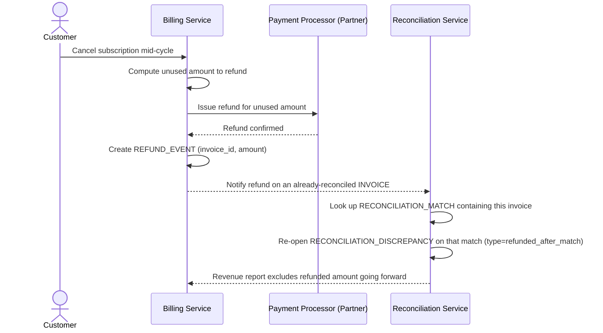

# Sequence Diagram — Enhance: Handle Post-Reconciliation Refund

Đây là **enhance**, flow mới xử lý trường hợp khách hủy gói giữa chu kỳ và được hoàn lại phần tiền chưa dùng *sau khi* invoice gốc đã đối soát khớp (xem [5-enhance-reconcile-billing-cycle-sqd.md](5-enhance-reconcile-billing-cycle-sqd.md)). Flow này đảm bảo yêu cầu "không để hệ thống báo cáo doanh thu vẫn tính khoản đã hoàn là doanh thu thực" bằng cách mở lại đối soát cho match liên quan.

