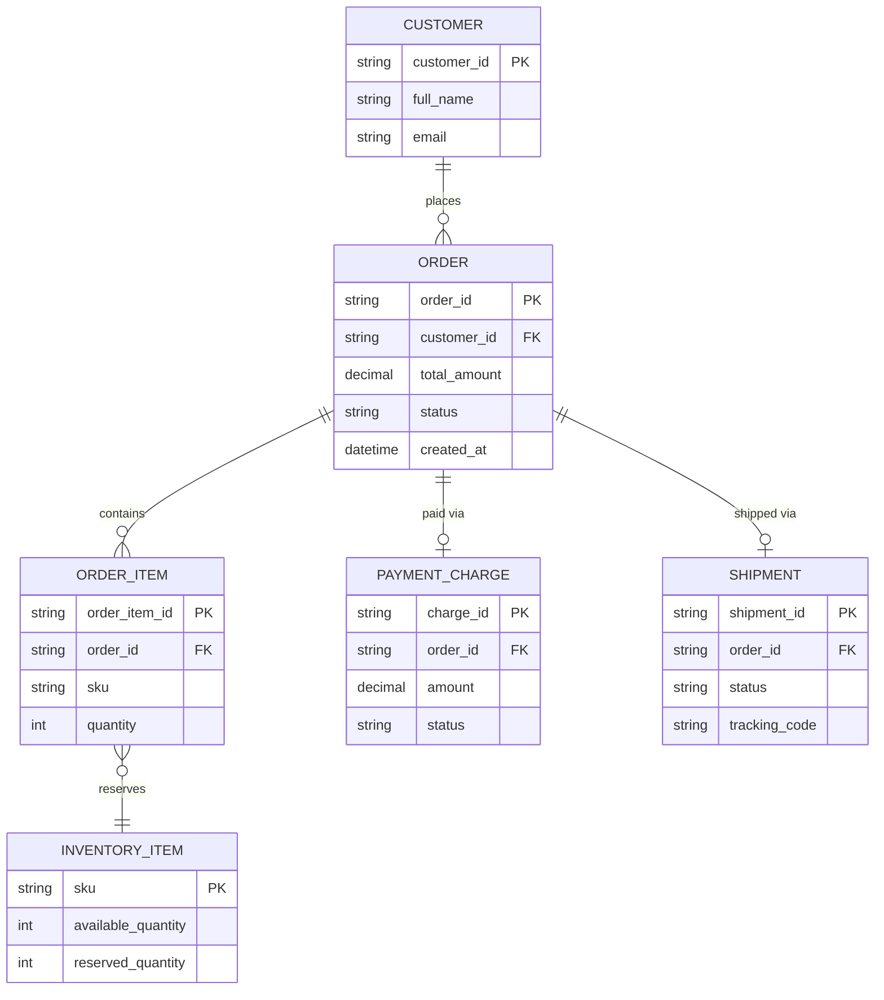

# ERD — Base (trước khi có saga orchestration)

Đây là **base**: mô hình dữ liệu suy luận cho checkout e-commerce *trước khi* có saga điều phối. Đề bài giả định hệ thống đã có `ORDER`, đã tích hợp Inventory/Payment/Shipping như 3 service riêng biệt — nếu không có sẵn các entity này thì "saga điều phối transaction xuyên 3 service" sẽ không có nghĩa. ERD chỉ dựng phần lõi phục vụ checkout, không suy diễn thêm các module không liên quan (khuyến mãi, đánh giá sản phẩm...).

