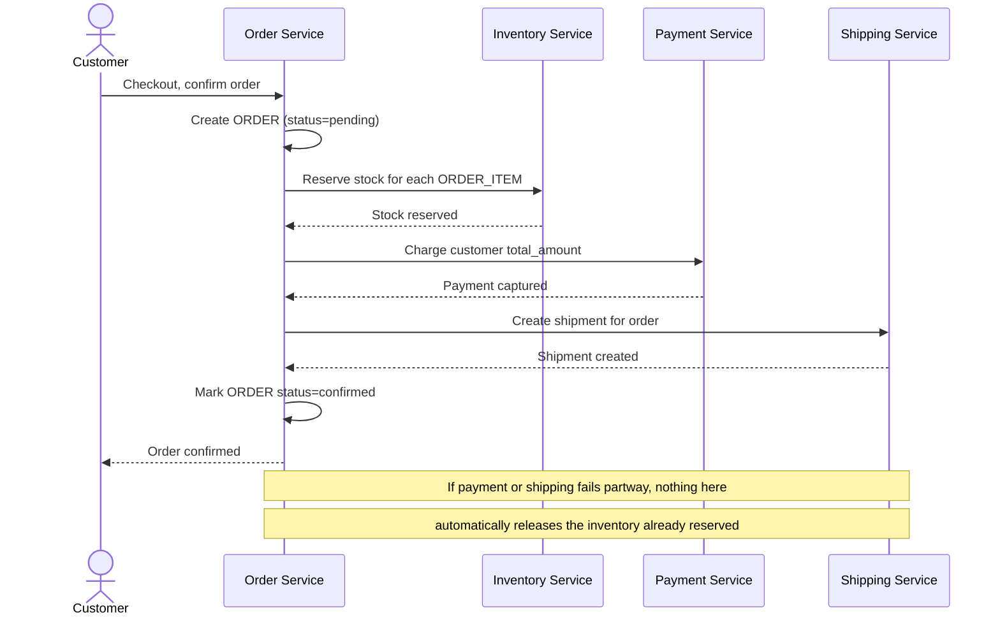

# Sequence Diagram — Base: Place Order

Đây là **base**, flow "đặt hàng" gọi tuần tự 3 service (Inventory, Payment, Shipping) — tiền đề cho saga: chính chuỗi bước reserve inventory → charge payment → create shipment ở đây là những gì saga sẽ điều phối lại. Ở base, flow gọi trực tiếp không qua orchestrator, không có compensate, không có persisted state, nên nếu một bước giữa chừng thất bại thì các bước trước đó không tự động được hoàn tác.

