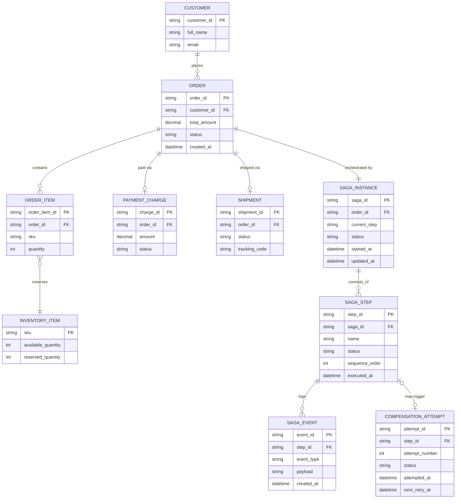

# ERD — Enhance (sau khi có saga orchestration)

Đây là **enhance**: ERD base cộng với các entity phục vụ đúng 5 yêu cầu của đề bài — định nghĩa từng bước saga và compensate tương ứng, persist saga state để resume khi crash, retry/escalate khi compensate thất bại, và event log để replay/audit. So với base, `ORDER` không đổi cấu trúc nhưng nay trạng thái của nó được dẫn dắt bởi `SAGA_INSTANCE` thay vì được set trực tiếp từ Order Service.

