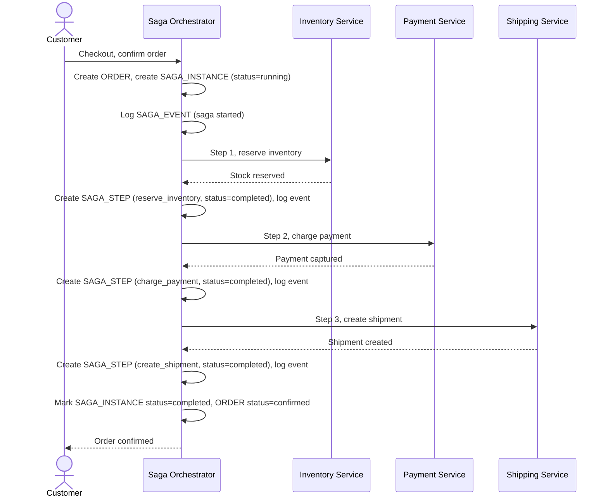

# Sequence Diagram — Enhance: Place Order (Happy Path)

Đây là **enhance**, flow "đặt hàng" đã có ở base ([2-base-place-order-sqd.md](2-base-place-order-sqd.md)) nhưng nay thay đổi căn bản: một Saga Orchestrator điều phối từng bước thay vì Order Service gọi trực tiếp, mỗi bước được ghi thành `SAGA_STEP` với `SAGA_EVENT` tương ứng, phục vụ replay/audit sau này.

