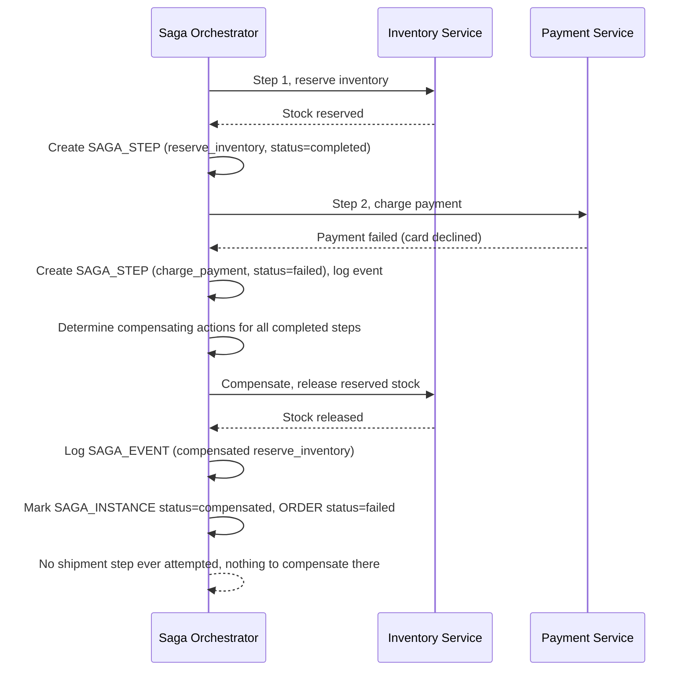

# Sequence Diagram — Enhance: Compensate Failed Checkout

Đây là **enhance**, flow mới xử lý trường hợp bước charge payment thất bại sau khi đã reserve inventory thành công. Flow này thể hiện yêu cầu "tự động gọi compensate để release inventory, order chuyển trạng thái failed chứ không kẹt lửng lơ" — điều mà base hoàn toàn không có.

