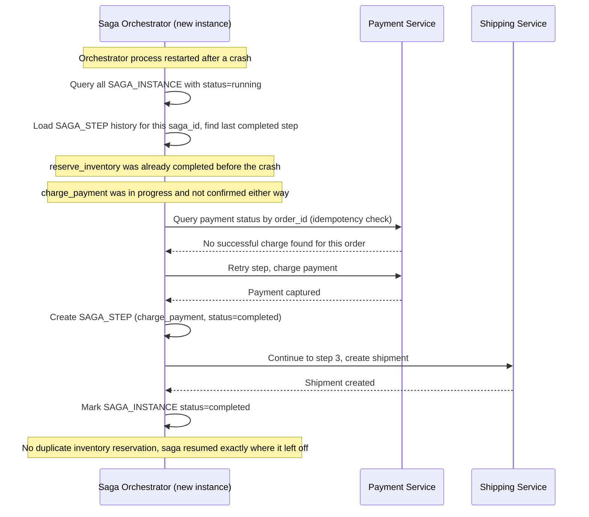

# Sequence Diagram — Enhance: Resume Saga After Orchestrator Crash

Đây là **enhance**, flow mới xử lý trường hợp Saga Orchestrator crash giữa chừng một saga. Flow này thể hiện yêu cầu "saga state phải được persist để resume đúng chỗ khi restart" — dựa vào `SAGA_INSTANCE.current_step` đã lưu thay vì chạy lại toàn bộ saga từ đầu.

