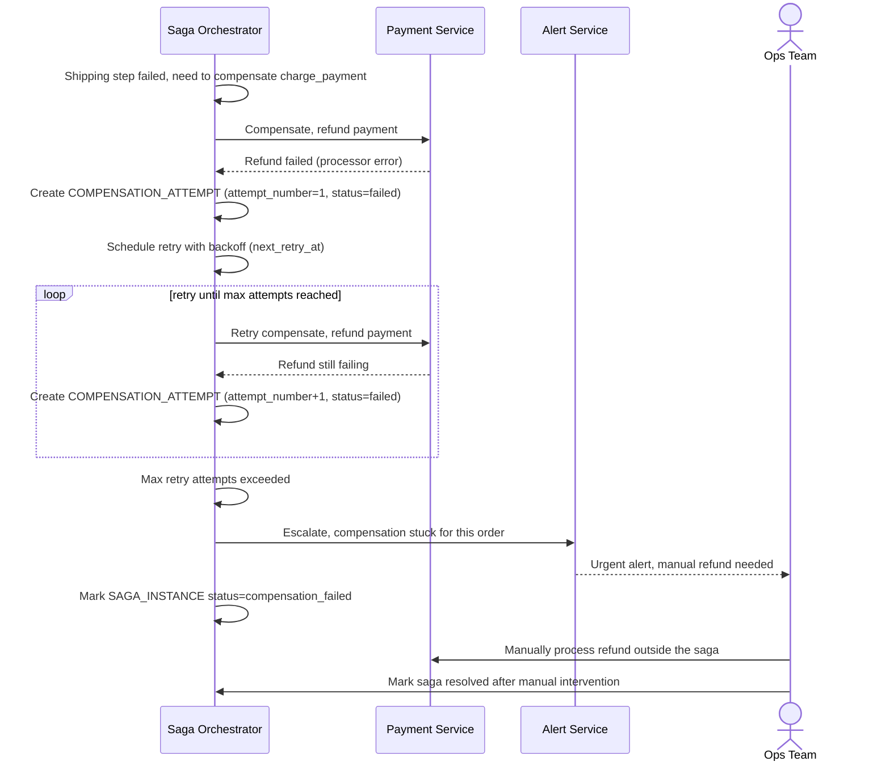

# Sequence Diagram — Enhance: Escalate Failed Compensation

Đây là **enhance**, flow mới xử lý trường hợp compensate cũng thất bại (ví dụ refund payment lỗi). Flow này thể hiện yêu cầu "retry với backoff, escalate sang xử lý thủ công/alert nếu vượt số lần retry" — trạng thái mà một saga đơn giản không xử lý được.

