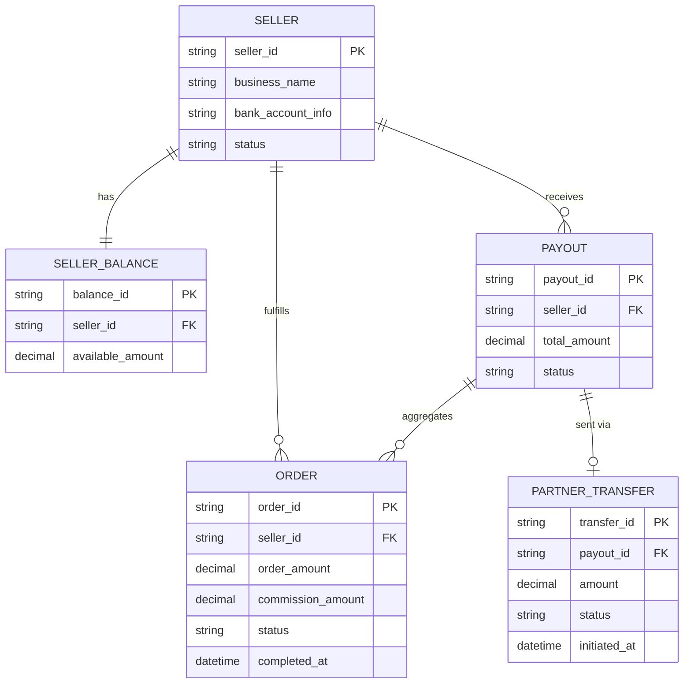

# ERD — Base (trước khi có saga payout)

Đây là **base**: mô hình dữ liệu suy luận cho marketplace *trước khi* có saga điều phối payout. Đề bài giả định sàn đã có `ORDER` hoàn tất, đã tính `SELLER_BALANCE` và đã tích hợp một đối tác thanh toán bên ngoài để chuyển tiền — nếu không có sẵn các entity này thì "saga điều phối trừ số dư và gọi đối tác chuyển tiền" sẽ không có nghĩa. ERD chỉ dựng phần lõi phục vụ payout, không suy diễn thêm các module không liên quan (catalog, review...).

