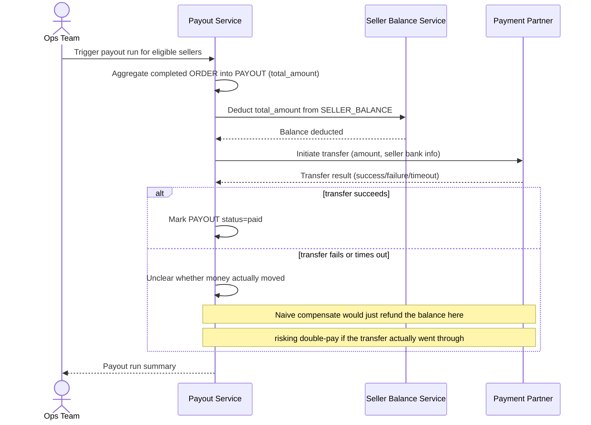

# Sequence Diagram — Base: Payout Seller

Đây là **base**, flow "chi trả cho seller" gọi tuần tự: tính hoa hồng, trừ số dư, rồi gọi đối tác chuyển tiền — tiền đề cho saga. Ở base, flow này còn đơn giản, chưa có compensate an toàn: nếu bước gọi đối tác timeout hoặc lỗi, không rõ nên hoàn số dư hay không, dễ dẫn tới double-pay hoặc mất tiền oan cho seller.

