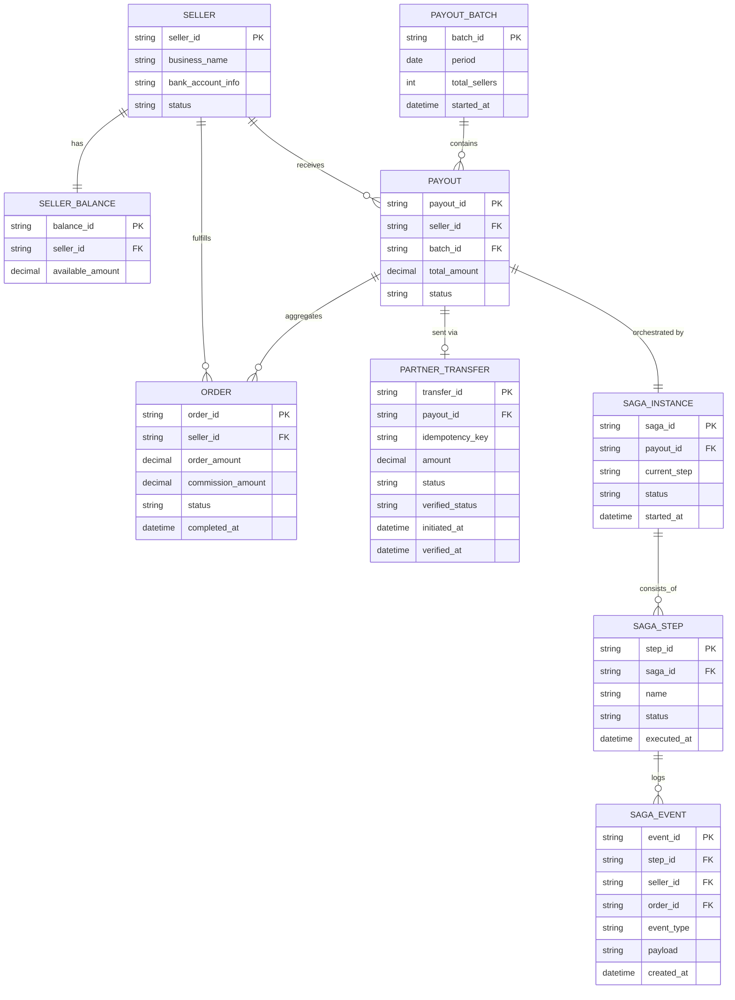

# ERD — Enhance (sau khi có saga payout)

Đây là **enhance**: ERD base cộng với các entity phục vụ đúng 5 yêu cầu của đề bài — verify trạng thái thực qua đối tác trước khi compensate, idempotent transfer reference, saga độc lập theo từng seller trong batch, và event log truy vấn theo seller/đơn hàng. So với base, `PARTNER_TRANSFER` nay có `idempotency_key` cố định và `verified_status` riêng biệt với `status` ban đầu, và mỗi `PAYOUT` gắn với một `SAGA_INSTANCE` độc lập trong `PAYOUT_BATCH`.

