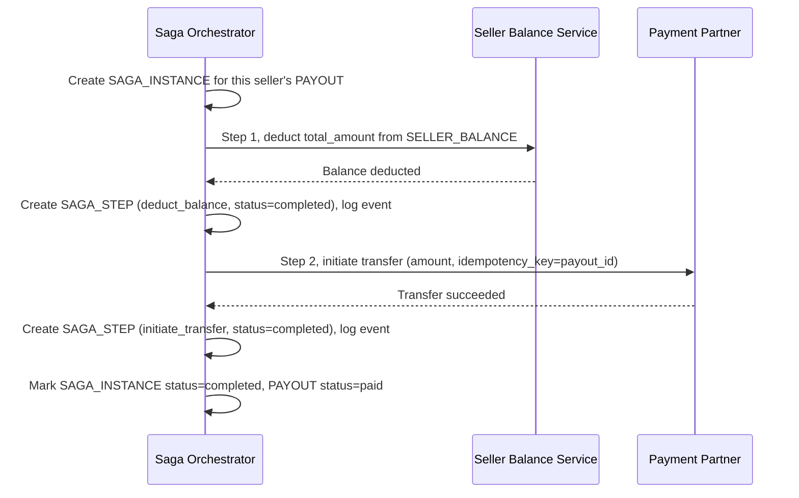

# Sequence Diagram — Enhance: Payout Seller

Đây là **enhance**, flow "chi trả cho seller" đã có ở base ([2-base-payout-seller-sqd.md](2-base-payout-seller-sqd.md)) nhưng nay thay đổi căn bản: mỗi seller có một `SAGA_INSTANCE` riêng, mỗi bước ghi `SAGA_STEP`/`SAGA_EVENT`, và lệnh chuyển tiền dùng `idempotency_key` cố định để retry an toàn thay vì gọi trực tiếp không kiểm soát như base.

