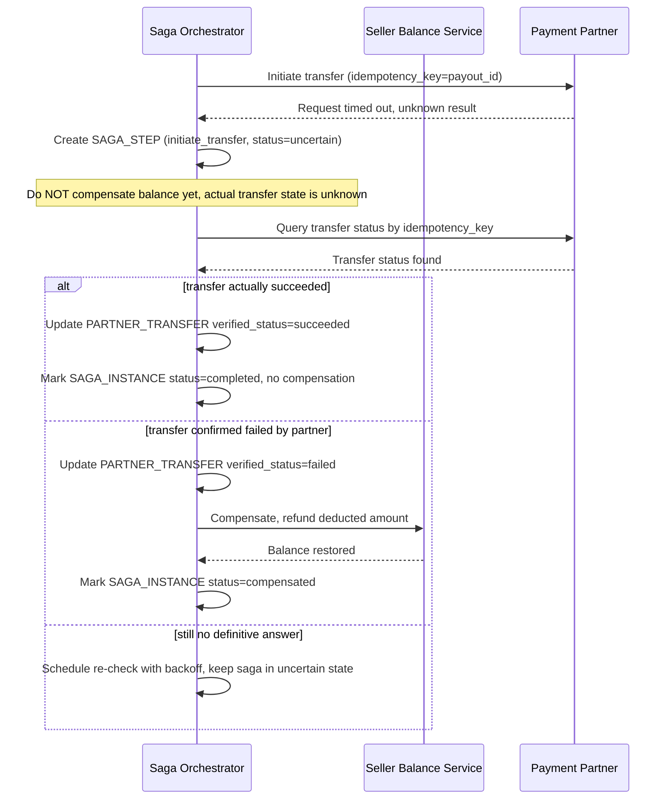

# Sequence Diagram — Enhance: Verify And Compensate On Timeout

Đây là **enhance**, flow mới xử lý trường hợp bước gọi đối tác timeout sau khi số dư seller đã bị trừ. Flow này thể hiện yêu cầu quan trọng nhất của đề bài: không tự động compensate ngay, mà phải verify trạng thái thực qua API đối chiếu/callback trước, tránh vừa mất tiền chuyển thật vừa hoàn số dư ảo (double-pay).

