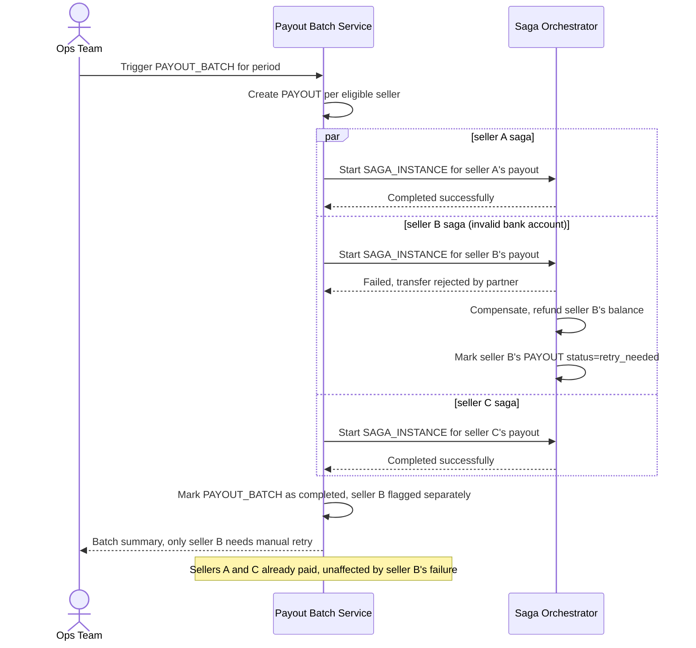

# Sequence Diagram — Enhance: Batch Payout Parallel Sellers

Đây là **enhance**, flow mới thể hiện yêu cầu "batch xử lý hàng nghìn seller cùng lúc, một seller lỗi không được làm dừng/rollback toàn bộ batch". Mỗi seller có `SAGA_INSTANCE` độc lập trong cùng `PAYOUT_BATCH`, chạy song song và không phụ thuộc lẫn nhau.

