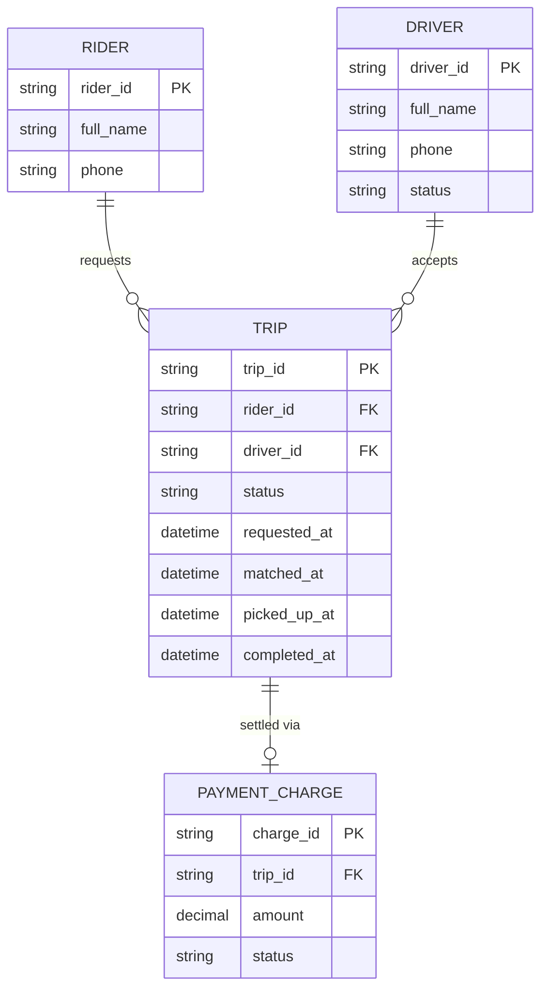

# ERD — Base (trước khi có saga điều phối vòng đời chuyến đi)

Đây là **base**: mô hình dữ liệu suy luận cho app gọi xe *trước khi* có saga điều phối. Đề bài giả định hệ thống đã có matching tài xế, trạng thái chuyến đi qua các bước cơ bản, và thanh toán cuối chuyến — nếu không có sẵn `TRIP` với các trạng thái này thì "saga điều phối vòng đời chuyến đi xuyên matching/trip/payment" sẽ không có nghĩa. ERD chỉ dựng phần lõi phục vụ vòng đời chuyến đi, không suy diễn thêm các module không liên quan (khuyến mãi, đánh giá...).

