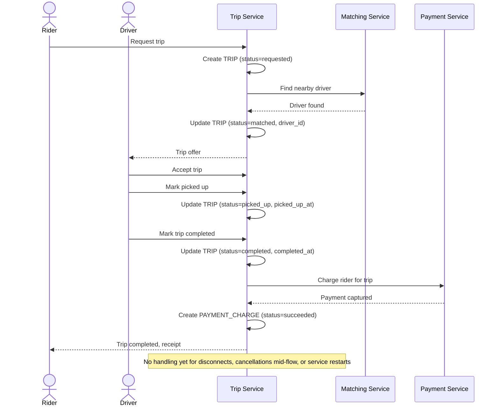

# Sequence Diagram — Base: Request And Complete Trip

Đây là **base**, flow vòng đời chuyến đi cơ bản: tìm tài xế → nhận cuốc → đón khách → hoàn thành → thanh toán — tiền đề cho saga. Ở base, flow gọi tuần tự đơn giản, chưa xử lý mất kết nối, hủy giữa chừng, race condition, hay resume khi service crash.

