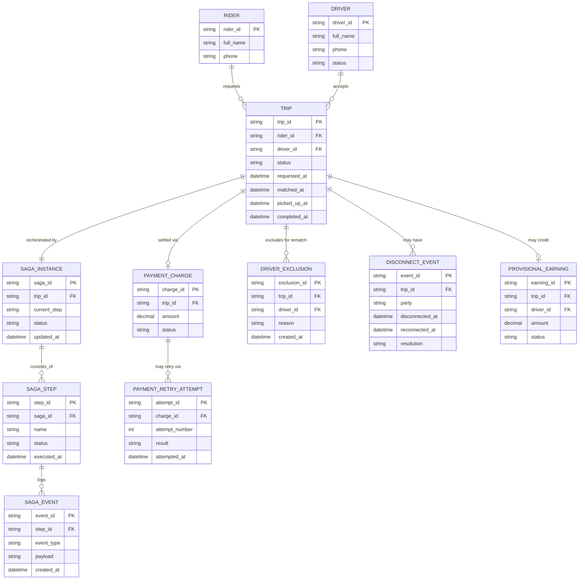

# ERD — Enhance (sau khi có saga điều phối vòng đời chuyến đi)

Đây là **enhance**: ERD base cộng với các entity phục vụ đúng 5 yêu cầu của đề bài — compensate khi tài xế tự hủy, cửa sổ chờ khi mất kết nối, luật ưu tiên cho race condition, trạng thái riêng cho thanh toán thất bại sau khi chuyến đã hoàn thành, và saga state persist để resume khi crash. So với base, `TRIP` nay được dẫn dắt bởi `SAGA_INSTANCE`, và có thêm entity theo dõi tài xế bị loại trừ, sự kiện mất kết nối, và thu nhập tạm cho tài xế khi thanh toán chưa xong.

