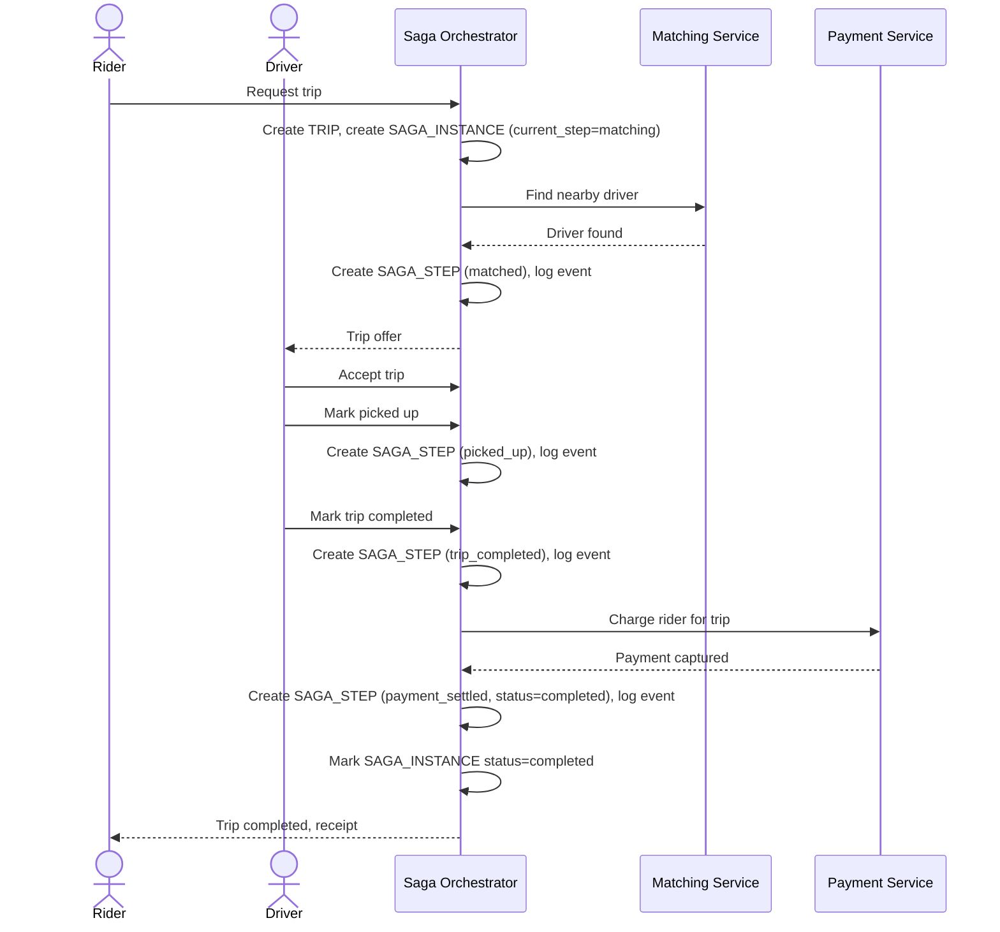

# Sequence Diagram — Enhance: Request And Complete Trip (Happy Path)

Đây là **enhance**, flow vòng đời chuyến đi đã có ở base ([2-base-request-and-complete-trip-sqd.md](2-base-request-and-complete-trip-sqd.md)) nhưng nay thay đổi căn bản: một Saga Orchestrator điều phối từng bước xuyên Matching/Trip/Payment, mỗi bước được ghi `SAGA_STEP`/`SAGA_EVENT` để có thể resume và audit lại toàn bộ hành trình.

