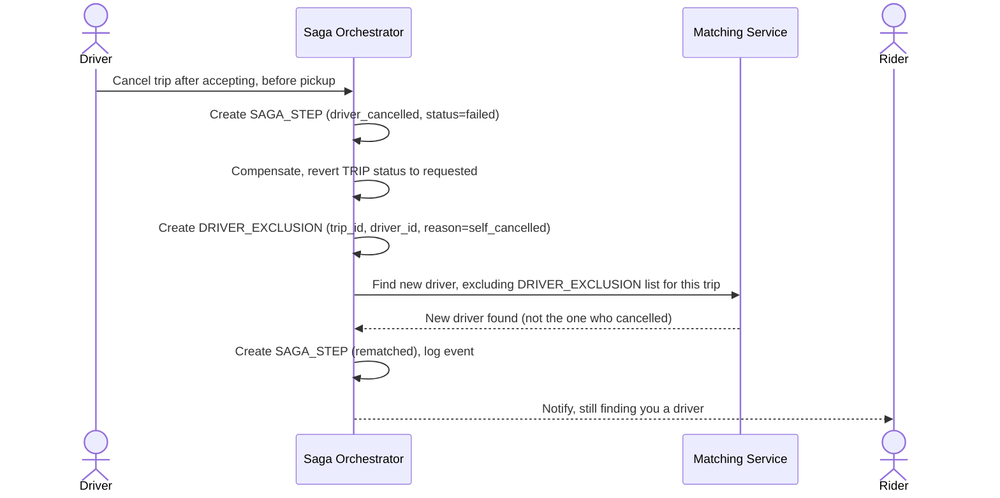

# Sequence Diagram — Enhance: Driver Cancel After Accept, Rematch

Đây là **enhance**, flow mới xử lý trường hợp tài xế đã "nhận cuốc" nhưng tự hủy trước khi đón khách. Flow này thể hiện yêu cầu compensate trả chuyến đi về trạng thái "tìm tài xế" và loại trừ tài xế vừa hủy khỏi vòng matching tiếp theo cho cùng chuyến, tránh matching lặp lại ngay với tài xế vừa từ chối.

